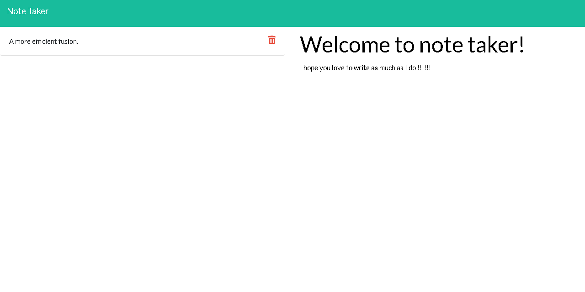

# Note Taker

## Description

A simple app that can take and store notes. Note Taker utilizes node.js and express server for the back end. The server handles storage of the users data. It also allows a user to retrieve thier data from anywhere on the internet. Note Taker is hosted on heroku and is available <a href = "https://fierce-brook-63566.herokuapp.com">here.</a>

     
  - [Description](#description)
  - [Installation](#installation)
  - [Usage](#usage)
  - [Credits](#credits)
  - [License](#license)
  - [Contributing](#contributing)
  - [Tests](#tests)
  - [Questions](#Questions)

## Installation

The package requires Node.js, Express server, and Uuid. It also requires Bootstrap and jQuery for the front end code.

